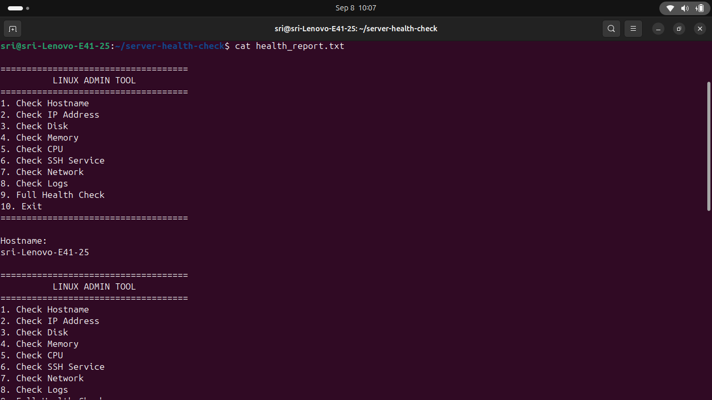
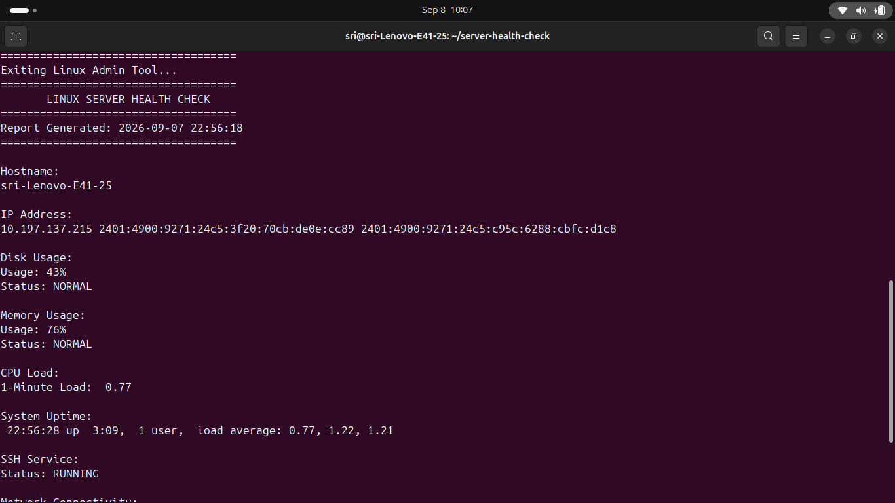
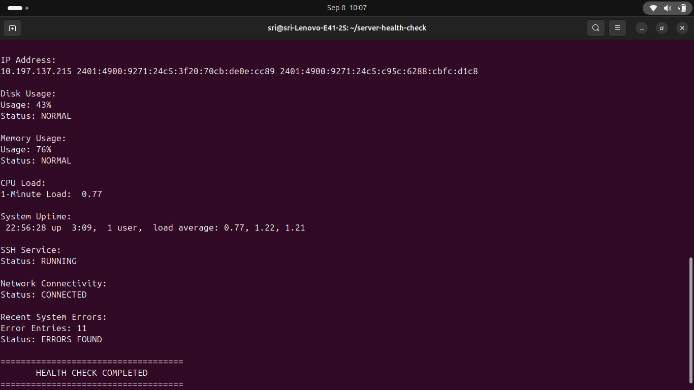

# Linux Server Health Check

A Bash-based Linux Server Health Check tool designed to monitor important system health parameters and provide quick troubleshooting information.

## 🚀 Features

- Hostname information
- IP address detection
- Operating system information
- Disk usage monitoring
- Memory usage monitoring
- CPU load monitoring
- System uptime
- SSH service status
- Network connectivity check
- Recent system error detection
- Menu-driven interface
- Health status reporting

## 🛠️ Technologies Used

- Linux
- Bash Shell Scripting
- Systemd
- Linux CLI
- Git & GitHub

## 📋 Health Checks

| Check | Description |
|---|---|
| Hostname | Displays system hostname |
| IP Address | Displays active IP address |
| OS | Displays Linux distribution information |
| Disk | Checks filesystem usage |
| Memory | Checks RAM utilization |
| CPU | Displays CPU load |
| Uptime | Shows system uptime |
| SSH | Checks SSH service |
| Network | Tests internet connectivity |
| Logs | Checks recent system errors |

## ⚙️ Installation

Clone the repository:

```bash
git clone https://github.com/sri-soundarraj/Linux-Server-Health-Check.git

## 🎯 Skills Demonstrated

- Linux System Administration
- Bash Scripting
- System Monitoring
- Service Management
- Troubleshooting
- Log Analysis
- Git & GitHub
- Automation

## 📸 Project Screenshots

### Full Health Check



### System Monitoring



### Server Status



## 📁 Project Structure

Linux-Server-Health-Check/
├── server_check.sh
├── README.md
├── .gitignore
├── LICENSE
├── screenshots/
│   ├── health-check-output1.png
│   ├── health-check-output2.png
│   └── health-check-output3.png
└── .github/
    └── workflows/
        └── shellcheck.yml

👨‍💻 Author

Sri Soundarraj

Aspiring System Administrator | Linux Administrator | Cloud Engineer
